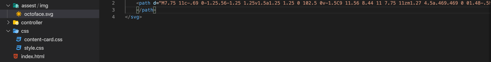

 
Favicon no es muy notable pero si eres como yo, te daras cuenta de que resalta bastante cuando tienes muchos tabs abiertos en tu browser. Algunos frameworks como Angular ya vienen con favicon activado pero que tal si queremos cambiarlo por nuestro propio icono.
 
Bueno no busques mas vamos a cubrir los detalles rápido y sencillo:
 
- HTML y Angular 9+.
 
**HTML y Angular 9+**
 
Para el propósito de este artículo ya e bajado el icono que usare pero si no tienes un icono no te preocupes, puedes descargar uno gratis en este site [**Font-Awesome**](https://fontawesome.com/icons?d=gallery).
 
Luego de descargar tu nuevo icono, buscalo en el folder de descargas en tu computadora y muévelo en el folder de nombre assets en tu aplicación web:

 
Abre tu archivo de entrada **index.html** or el archivo de entrada con otro nombre y inserta las siguiente linea en la section **head** de tu archivo HTML con el nombre de tu nuevo icono. En mi caso es **octoface.svg**:
```
<link rel="icon" type="image/x-icon" href="/assest/img/octoface.svg"/>
```
 
Felicidades! Al final tu aplicación web tiene un rostro.
 
 

