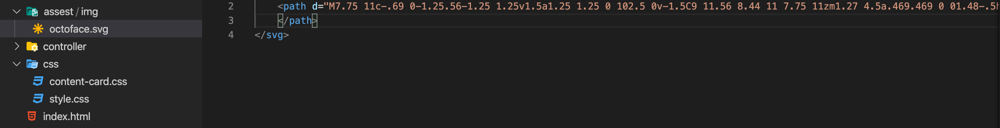

 
Favicon is not very noticeable at first but if you are like me, it will stand out when you have a lot of tabs open in your browser. Frameworks like Angular come with their brand icon by default already but what about if we want to change it with our own icon.
 
Well look not further we will go into the details on how to do it step by step:
 
- HTML and Angular 9+.
 
**HTML and Angular 9+**
 
Let's start with HTML. For the purpose of this article I already have an icon downloaded but if don't have one don't worry, you can get one for free at [**Font-Awesome**](https://fontawesome.com/icons?d=gallery).
 
After you download your brand new icon find it in your downloads and place it in the assets folder of your web application:

 
Open your **index.html** or the entry point for your application and add the following line in the **head** section of your HTML. The name on my icon is **octoface.svg**:
```
<link rel="icon" type="image/x-icon" href="/assest/img/octoface.svg"/>
```
 
Congratulations! your web application is no longer faceless.
 
 

