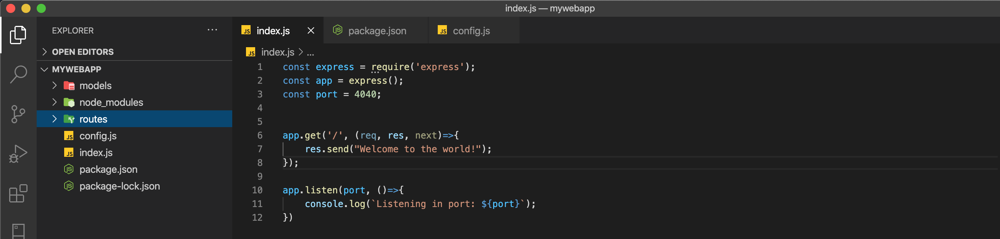

Bienvenidos a la segunda parte de nuestro tutorial sobre Express, en esta parte vamos a tratar sobre la estructura de archivos de express. También hablaremos sobre la creación de un archivo de configuración y cómo lo podemos usar para cambiar de entorno de desarrollo facil y rapido.

**Express** como muchos otros marcos de referencias basados en **NodeJS** como **restify**, **fastify**, etc. No vienen con una estructura de archivos que seguir exactamente, puedes estructurar tu aplicación como desees pero para propósitos de esta jornada usaremos el patrón de diseño **MVC**.
```
- Modelo Vista Controlador(MVC).
- Archivo de configuración..
```
**MVC**

Modelo Vista Controlador(MVC) es un patrón de diseño que separa la lógica de negocios de tu aplicación en diferentes secciones que facilitan la organización. Este patrón de diseño es muy usado en el desarrollo de aplicaciones porque es fácil de entender y sencillo a la misma vez. Ahora vamos a hablar un poco sobre cada una de las secciones:

**Modelo**: Los modelos solo nos ayudan a estructurar la información de nuestra aplicación, ninguna lógica de funcionamiento debe de implementarse en estos archivos.

**Vista**: Las vistas nos ayudan a presentar la información que guardan o estructuran nuestros modelos, las vistas no deben de alterar o manipular la información.

**Controlador**: Estos funcionan como una especie de mediador entre las vistas y los modelos manejando los eventos que las vistas procesan. La lógica de que se debería hacer después que un evento es ejecutado se debe de procesar aquí para que se refleje automáticamente en la vista.

**Creación de directorios**

En la parte uno de este tutorial creamos una aplicación en la carpeta **mywebapp**. Dentro de nuestra carpeta raíz debemos de crear dos carpetas mas, las cuales representaran nuestro patron de diseno **MVC** pero recordemos que esta es una aplicación para el backend y no utilizaremos el directorio para vistas por el momento. Como nuestra aplicación es simple y no mucha logica de negocios se implementara cambiaremos nuestra carpeta llamada **controlador** por **Rutas**:
```
mkdir models
mkdir routes
```

Ahora que tenemos un entendimiento sobre la estructura de archivos vamos a seguir con la creación de varios entornos de desarrollo. No te preocupes si ahora mismo no se notan los beneficios de utilizar este patrón de diseño, lentamente le veremos los beneficios.


**Creando varios entornos de desarrollo**

Trabajar con varios entornos de desarrollo suena un poco tedioso pero en realidad no lo es. Una de las ventajas de utilizar este método que veremos a continuación es que nos permite tener variables con valores para correr nuestra aplicación localmente sin tener que cambiar los valores de las variables para correr en producción.
Empecemos por crear el archivo de configuración:
```
touch config.js
```
Abrimos nuestro archivo nuevo y le agregamos las siguientes líneas:
```
module.exports = {
  ENV: process.env.NODE_ENV || 'development',
  PORT: process.env.PORT || 4040
}
```
Como podemos notar acabamos de crear un objeto con dos variables pero podemos agregar todas las que deseemos, por ahora solo nos enfocaremos en **ENV** y **PORT**. 

Cuando inicializamos nuestra aplicación **Node** busca las variables de proceso en nuestro sistema y si no están presente entonces se usan los valores por defecto en nuestro archivo de configuraciones. En este caso los valores son **development** para desarrollo y **4040** para el puerto.

Editando nuestro archivo **index.js** que creamos en la primera parte de esta serie:



En la primera parte de nuestra jornada nosotros agregamos una variable para el puerto como lo muestra la imagen de arriba, nosotros modificaremos nuestro archivo **index.js** importando el nuevo archivo de configuración.
Remueve la variable **PORT** y agreguemos las siguientes líneas:

```
const express = require('express');
const app = express();
const config = require('./config');


app.get('/', (req, res, next)=>{
  res.send("Welcome to the world!");
});

app.listen(config.PORT, ()=>{
  console.log(`Listening in port: ${config.PORT}`);
});

```
Si seguiste todos los pasos al pie de la letra, tu application debería de inicializar sin problemas.
```
npm start
```

**Conclucion**

En esta lección hablamos sobre el patrón de diseño **MVC** y como crear variables de entorno, Si te parece un poco abrumador no te preocupes estos temas los entenderemos con paciencia. En nuestra próxima parte hablaremos sobre **importaciones** y **modulos**.

