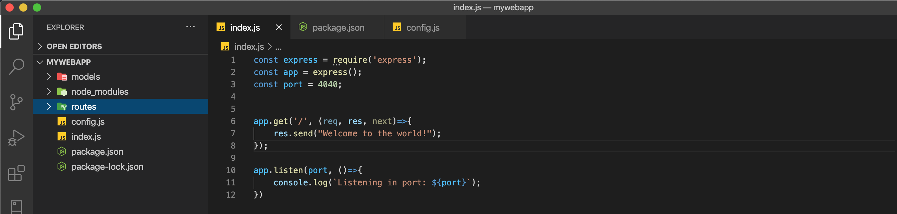

Welcome back to part two of our Express tutorial, in this part we are going to talk about express file structure and what exactly I mean by file structure. Also we will go over how to create a configuration file and use it to change to different environments of development.

Express like many other **NodeJS** backend frameworks like restify, fastify, etc. Don’t really come with a file structure that we have to follow, you can structure your backend application any way you like but for the purpose of this journey we will use a MVC design pattern.
```
- Model View Controller(MVC).
- Configuration file.
```
**MVC**

Model View Controller(MVC) is a design pattern used to separate the business logic of your application into sections. This pattern is commonly used in the software industry because it is quite easy to understand and very straightforward, now let’s talk about each of the sections.

**Model**: The model only helps us to structure the data, no logic should be implemented in these files.

**View**: Help us to present data from the Models to the user, it doesn’t know what it means or what the user can do to manipulate the data.

**Controller**: They act as middlemen between the views and the models by handling events triggered by the views. Logic of what to do after an event is triggered is handled here and the process to automatically reflect such changes on the view.

**Directories creation**

In part one we created a folder for our application call **mywebapp**. Inside our root folder we should create two folders that will represent our MVC pattern but remember this is a backend application and the view directory is not going to be used for now. Because we will make a simple application our **controllers** directory will be replace for **Routes**:

```
mkdir models
mkdir routes
```

Now that we have an understanding of our file structure let’s move on to how to create multiple development environments. Don’t worry if you don't see the benefits of using this design pattern right now, we will slowly pick up while we build our full application.


**Creating multiple environments**

Working with multiple environments sounds a bit tedious but is not. The good thing about this is that it allows you to set local values to run your application in your local environment and at the same time allows you to transition to production without changing anything.

Let’s start by creating a configuration file:
```
touch config.js
```
Open the newly created file and add the following lines:
```
module.exports = {
  ENV: process.env.NODE_ENV || 'development',
  PORT: process.env.PORT || 4040
}
```
As you can see we create an object with two variables for now but notice that we can add more variables as we see fit, for now we will focus on the **ENV** and **PORT**. When you run a node application it automatically look for process environment variable and if they aren’t present it take the default value that we gave them, in this case our default values are **development** and **4040** for the port.

Edit the **index.js** file that we created in the first part of the series:




In the first part of the journey we added a **Port** variable how is shown in the image above, we will edit the **index.js** file by importing our config file, removing the port variable and use the port variable from our config file, your application should look something like this:

```
const express = require('express');
const app = express();
const config = require('./config');


app.get('/', (req, res, next)=>{
  res.send("Welcome to the world!");
});

app.listen(config.PORT, ()=>{
  console.log(`Listening in port: ${config.PORT}`);
});

```

If you follow everything along the lines your application should run in the original port without any issues.
```
npm start
```

**Conclusion**

In this lesson we talk about design patterns and environment variables, don’t get overwhelmed by this term we will get all of them slowly. In the next lesson we will talk more about **imports** and **modules**.

